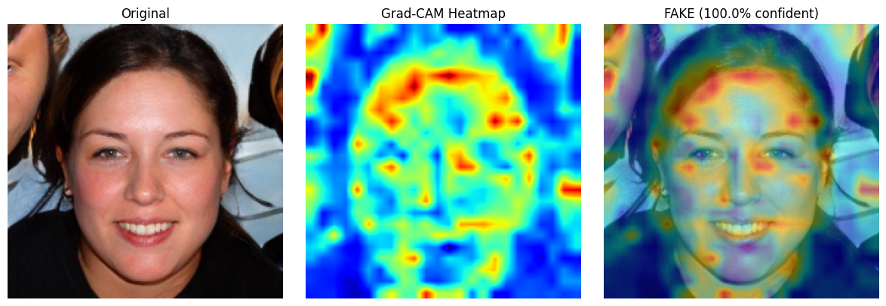
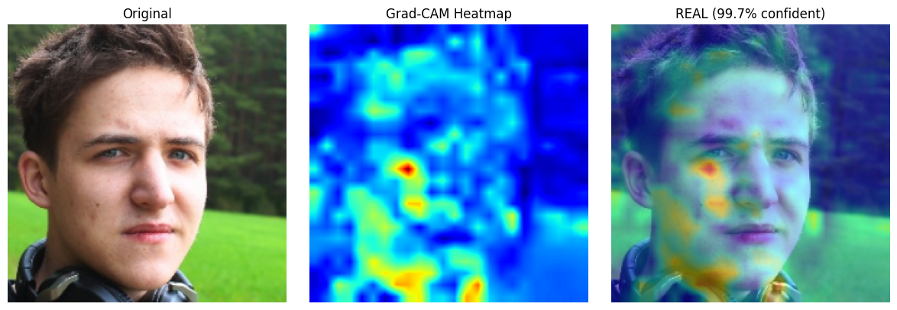
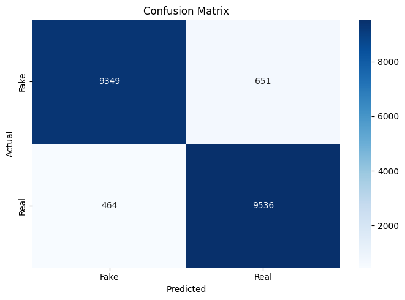
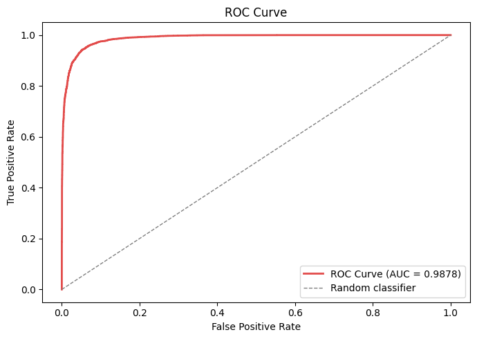

# DeepScan — AI-Powered Deepfake Detection

> "Every deepfake we detect is a digital identity we protect, a truth we preserve, and a future we secure."

Built by **FakeProof Labs** | S-VYASA Deemed to be University | AIONAI Club | Expo: April 23, 2025

---

## What is this?

DeepScan is an AI-powered system that detects whether a face image is real or AI-generated (deepfake) — and explains *why*. Unlike existing detectors that act as black boxes, DeepScan highlights the exact facial regions that triggered the decision using Grad-CAM heatmaps.

---

## The problem

With the rapid rise of AI-generated media, deepfakes have become increasingly realistic and accessible. This creates serious risks in misinformation, digital fraud, identity misuse, and erosion of trust in visual content. Most detection tools give a verdict with no explanation — which limits trust and practical usability.

---

## Our solution

A deep learning pipeline that:

- Detects whether an uploaded face image is **real or fake**
- Provides a **confidence score** (e.g. 87% fake)
- Generates a **Grad-CAM heatmap** showing which facial regions were suspicious
- Explains the verdict in plain language (e.g. "Unnatural blending detected around eye region and jaw boundary")

---

## Results

| Metric | Score |
|---|---|
| Test Accuracy | **94.42%** |
| Validation Accuracy | **94.4%** |
| AUC-ROC | **0.9878** |
| F1 Score (Fake) | **0.94** |
| F1 Score (Real) | **0.94** |
| Fake detection confidence (sample) | 100% |
| Real detection confidence (sample) | 99.7% |
| Fakes correctly caught (test set) | 9,349 / 10,000 |
| Real images correctly identified | 9,536 / 10,000 |

---

## Grad-CAM results

### Fake image — detected at 100% confidence


*Red/warm regions show where the model detected deepfake artifacts — typically around face boundaries, forehead and jaw where GAN generation fails.*

### Real image — detected at 99.7% confidence


*Activation spread naturally across facial features — consistent with how real faces are structured.*

---

## Evaluation plots

### Confusion matrix


### ROC curve


---

## Tech stack

| Component | Technology |
|---|---|
| Model | CNN (4 conv layers) built with TensorFlow/Keras |
| Explainability | Grad-CAM heatmap overlay |
| Dataset | 140k Real and Fake Faces (Kaggle, xhlulu) |
| Frontend | Streamlit with custom CSS |
| Training environment | Google Colab (T4 GPU) |
| Version control | GitHub |

---

## Dataset

**140k Real and Fake Faces** by xhlulu on Kaggle

- 70,000 real faces (sourced from Flickr)
- 70,000 AI-generated fake faces (GAN-generated)
- Pre-split into train / valid / test
- Images resized to 224×224, normalized to 0–1

---

## Model architecture

```
Input (224×224×3)
→ Conv2D(32) + BatchNorm + MaxPooling      # detects edges, colours
→ Conv2D(64) + BatchNorm + MaxPooling      # detects textures, skin patterns
→ Conv2D(128) + BatchNorm + MaxPooling     # detects face parts
→ Conv2D(128) + BatchNorm + MaxPooling     # detects deepfake artifacts
→ Flatten
→ Dense(256) + Dropout(0.5)
→ Dense(1, sigmoid)                        # outputs confidence score 0–1
```

Total parameters: ~4.96 million

---

## Project structure

```
deepfake-Projectexpo/
├── notebooks/
│   └── Training.ipynb       ← full pipeline: training + Grad-CAM + evaluation
├── src/                     ← preprocessing and utility scripts
├── models/
│   └── best_model.h5        ← trained model (94.4% val accuracy)
├── app/                     ← Streamlit frontend
├── assets/
│   ├── gradcam_fake.png     ← Grad-CAM output on fake image
│   ├── gradcam_real.png     ← Grad-CAM output on real image
│   ├── confusion_matrix.png ← evaluation plot
│   └── roc_curve.png        ← evaluation plot
├── data/                    ← dataset (not pushed to GitHub)
├── .gitignore
└── README.md
```

---

## How to run

**1. Clone the repo**
```bash
git clone https://github.com/Manas-172006/deepfake-Projectexpo.git
cd deepfake-Projectexpo
```

**2. Install dependencies**
```bash
pip install tensorflow streamlit opencv-python matplotlib scikit-learn seaborn
```

**3. Download the dataset**

Get the dataset from [Kaggle](https://www.kaggle.com/datasets/xhlulu/140k-real-and-fake-faces) and place it in the `data/` folder.

**4. Run the app**
```bash
cd app
streamlit run app.py
```

---

## Status

- [x] CNN model trained — 94.42% test accuracy
- [x] Grad-CAM heatmap visualization working
- [x] Evaluation complete — AUC-ROC 0.9878, F1 0.94
- [ ] Streamlit UI with confidence score display
- [ ] Demo screenshots

---

## Team

**FakeProof Labs**
S-VYASA Deemed to be University — AIONAI Club
Project Expo — April 23, 2025
