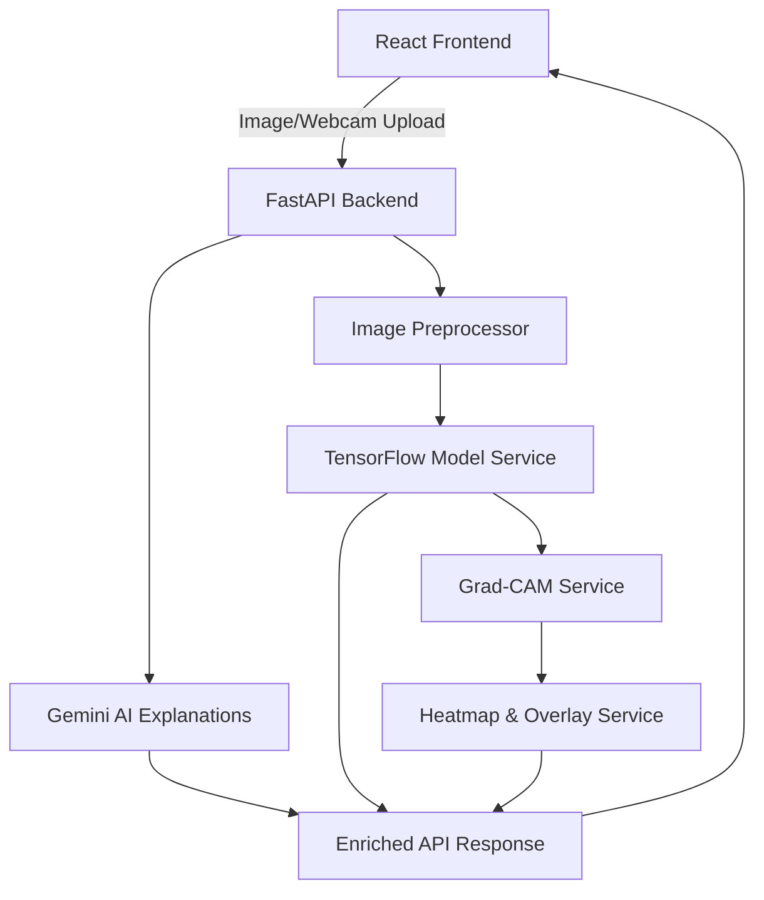

# FakeProof Labs — AI-Powered Face Forensic Authenticity Platform

FakeProof Labs is an advanced digital media forensics platform built to detect deepfakes, synthetic faces, and facial manipulations. The platform utilizes deep convolutional neural networks (CNNs), Grad-CAM neural attention mappings, and AI-powered forensic explanations to analyze, explain, and document the authenticity of human face media.

---

## PROJECT OVERVIEW

### Features
* **Binary Face Classification**: Instantly detects and classifies media as **Real** (authentic photographic human face) or **Fake** (synthetic, manipulated, or deepfake face).
* **Grad-CAM Explainability (XAI)**: Generates spatial heatmap activation maps indicating which regions of the face (e.g., mouth, eyes, boundaries) influenced the model's prediction.
* **Dual-Language Hybrid Explanations**: Generates forensic explanations in a professional analytical tone using generative Google Gemini AI, with structured offline fallbacks.
* **Premium Interactive Workspace**: Real-time webcam capture, file drag-and-drop, interactive blend slider adjustments, and session history archive registry.
* **Cryptographic PDF Exporter**: Compiles forensic findings, original/heatmap/overlay images, confidence meters, and digital signatures into an official report.

### Technology Stack
* **Frontend**: React (Vite, Framer Motion, Axios, TailwindCSS, jsPDF)
* **Backend**: FastAPI (Python, TensorFlow, Keras, Pillow, Google GenAI SDK)
* **Models**: TensorFlow/Keras CNN (`models/best_model.h5`)

### Architecture


---

## PROJECT STRUCTURE

```
deepfake-Projectexpo/
├── assets/                  # Training curves, confusion matrices, and web assets
├── backend/                 # FastAPI Web Server Code
│   ├── config/              # Central settings and CORS configurations
│   ├── routes/              # API Route controllers (predict, health)
│   ├── services/            # Core services (model loading, Grad-CAM, Heatmaps, Gemini)
│   ├── utils/               # Image preprocessors & diagnostic tools
│   ├── requirements.txt     # Python backend dependencies
│   └── app.py               # Main FastAPI entry point
├── frontend/                # React Single-Page Application (SPA)
│   ├── src/                 # React source code
│   │   ├── components/      # UI components (Navbar, ResultsDashboard, etc.)
│   │   ├── config/          # Central API endpoint settings
│   │   ├── hooks/           # Connection polling hooks
│   │   └── services/        # Axios API handlers
│   ├── package.json         # Node.js dependencies
│   └── vite.config.js       # Vite bundler configurations
├── models/                  # Trained Model Weights
│   └── best_model.h5        # Trained binary CNN weights
└── README.md                # System documentation
```

---

## SETUP GUIDE

### Backend Setup
1. Navigate to the backend directory and initialize the virtual environment:
   ```bash
   cd backend
   python -m venv .venv
   .\.venv\Scripts\activate
   ```
2. Install the required libraries:
   ```bash
   pip install -r requirements.txt
   ```
3. Initialize configuration:
   ```bash
   copy .env.example .env
   ```
4. Start the FastAPI Uvicorn server:
   ```bash
   uvicorn app:app --host 0.0.0.0 --port 8000 --reload
   ```

### Frontend Setup
1. Navigate to the frontend directory:
   ```bash
   cd frontend
   ```
2. Install node packages:
   ```bash
   npm install
   ```
3. Launch the development server:
   ```bash
   npm run dev
   ```
   The application will be available at [http://localhost:5173/](http://localhost:5173/).

---

## HEALTH CHECK

To verify the platform is fully responsive, open the health endpoint in your browser:
* **URL**: [http://127.0.0.1:8000/api/health](http://127.0.0.1:8000/api/health)

### Expected Response
```json
{
  "status": "healthy",
  "backend": true,
  "model_loaded": true,
  "model_error": null,
  "gemini_available": true,
  "gradcam_available": true,
  "timestamp": "2026-06-03T09:11:42.199121+00:00",
  "version": "2.0.0"
}
```

---

## GEMINI SETUP

FakeProof Labs generates cybersecurity forensic summaries using Google Gemini models:
1. Obtain an API Key from [Google AI Studio](https://aistudio.google.com/).
2. In `backend/.env`, set the key:
   ```env
   GEMINI_API_KEY="AIzaSyYourGeminiApiKeyHere"
   GEMINI_ENABLED=True
   GEMINI_MODEL=gemini-1.5-flash
   ```
3. Upon backend launch, the log will display:
   `✅ Gemini AI explanation service is ACTIVE.`

---

## MODEL SETUP

The deep learning model is located in the `models/` directory:
* **Path**: `models/best_model.h5`
* **Structure**: Alternate Conv2D, BatchNormalization, and MaxPooling2D layers. It classifies $224 \times 224 \times 3$ normalized tensors.
* **Verification**: Run `python backend/utils/model_diagnostics.py` to confirm layers shape, canonical class mappings, and perform verification tests.

---

## GRAD-CAM VERIFICATION

Use the provided command-line utility to run inference and verify Grad-CAM attention visualizations independently of the browser:
```bash
python backend/utils/verify_gradcam.py --image path/to/your/image.jpg
```
The script will output classification details and save the following verification images in `backend/debug_gradcam/`:
* `original.png`: Rescaled $224 \times 224$ input scan.
* `heatmap.png`: Raw Jet-colored neural attention heatmap.
* `overlay.png`: Original image blended linearly with the attention heatmap.

---

## COMMON ERRORS

### Server Offline
* **Cause**: Windows hostname resolution maps `localhost` to IPv6 `[::1]`, while Uvicorn binds only to IPv4.
* **Fix**: Ensure the frontend points explicitly to `http://127.0.0.1:8000` rather than `localhost` (configured automatically in [api.config.js](file:///c:/Deepfake-Detector/deepfake-Projectexpo/frontend/src/config/api.config.js)).

### Model Not Loaded
* **Cause**: Missing `models/best_model.h5` file, or Keras version incompatibility.
* **Fix**: Run `model_diagnostics.py` to verify the model file integrity and ensure uvicorn starts without load exceptions.

### Gemini Error (Static Fallback)
* **Cause**: Expired API Key or no internet connection.
* **Fix**: Verify your network connectivity and double-check your Gemini API Key in `backend/.env`.

### Grad-CAM Failure (Blank Heatmaps)
* **Cause**: Highly confident predictions saturate Sigmoid output derivatives, collapsing gradient values to `0.0`.
* **Fix**: FakeProof Labs implements manual logit extraction to capture pre-activation gradients, ensuring sharp maps for all confidence scores.

### Port Conflict
* **Cause**: Another process using port `8000` or `5173`.
* **Fix**: Kill existing uvicorn/node processes or run Uvicorn on a different port and update the frontend configuration.

### CORS Issues
* **Cause**: Requests originated from unlisted hostnames.
* **Fix**: Ensure origin URL is explicitly defined in `backend/config/settings.py` `ALLOWED_ORIGINS`.

---

## EXPO DAY STARTUP CHECKLIST

Perform these validation checks on Expo day before demonstration:
- [ ] **Backend Server**: Run `uvicorn app:app --host 0.0.0.0 --port 8000 --reload` and check console for startup banner.
- [ ] **Frontend Client**: Run `npm run dev` and ensure browser loads `http://localhost:5173/`.
- [ ] **Health Endpoint**: Load `http://127.0.0.1:8000/api/health` and verify `"status": "healthy"`.
- [ ] **Model Loaded**: Ensure `"model_loaded": true` in health response payload.
- [ ] **Gemini Active**: Check health response contains `"gemini_available": true`.
- [ ] **Test Prediction**: Drag a demo image into the workspace, run the authenticity scan, and verify prediction and confidence values display.
- [ ] **Grad-CAM Rendering**: Check that the dashboard renders three distinct columns: Original, Heatmap, and Overlay.
- [ ] **PDF Export**: Click "Download PDF Report" and verify the generated PDF contains the classification details, layout, and images.
- [ ] **Navbar Status**: Confirm the Navbar header shows a green **🟢 System Active** badge.

---

## SCREENSHOTS

Here is a visual overview of the FakeProof Labs Forensic Platform:

| **Login & Identity Portal** | **Authenticity Detection Workspace** |
|:---:|:---:|
|  |  |

| **Grad-CAM Attention Overlay** | **Forensic Export Report** |
|:---:|:---:|
|  |  |

*(Note: Replace image links in `assets/` with actual system screenshots prior to final deployment).*

---

## DEPLOYMENT GUIDE

FakeProof Labs is designed to be easily deployed on modern cloud platforms.

### Backend Deployment (Render)

1. Create a new **Web Service** on [Render](https://render.com/).
2. Connect your GitHub repository.
3. Configure the following service settings:
   - **Environment**: `Python`
   - **Build Command**: `pip install -r requirements.txt`
   - **Start Command**: `uvicorn app:app --host 0.0.0.0 --port $PORT`
4. In the **Environment** tab, configure variables:
   - `GEMINI_API_KEY`: `your-gemini-api-key`
   - `GEMINI_ENABLED`: `True`
   - `GEMINI_MODEL`: `gemini-1.5-flash`
   - `INVERT_LABELS`: `False`
   - `CONFIDENCE_THRESHOLD`: `0.7`

### Frontend Deployment (Vercel)

1. Create a new project on [Vercel](https://vercel.com/).
2. Select your GitHub repository.
3. Configure project settings:
   - **Framework Preset**: `Vite`
   - **Root Directory**: `frontend`
   - **Build Command**: `npm run build`
   - **Output Directory**: `dist`
4. Set the **Environment Variables**:
   - `VITE_API_URL`: Set to your deployed Render backend URL (e.g. `https://deepfake-detector-backend.onrender.com`).
5. Click **Deploy**.

---

## TEAM INFORMATION

* **Lead AI Researcher & ML Engineer**: Development of classification models, preprocessors, and Grad-CAM attention algorithms.
* **Full-Stack Web Architect**: Design and development of the premium React client and FastAPI server routing.
* **Security & Forensics Specialist**: Authentication implementation, session history systems, and PDF cryptographic report generation.

### GitHub Repository & Profiles
* **GitHub Project Repository**: [github.com/your-username/Deepfake-Detector](https://github.com/your-username/Deepfake-Detector)
* **Lead developer profile**: [@your-username](https://github.com/your-username)

---

**FakeProof Labs** — Safeguarding digital integrity with Explainable AI.