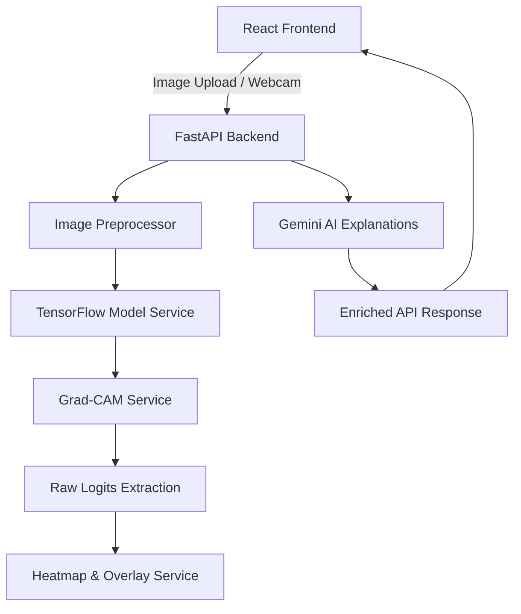

# FakeProof Labs — Forensic Face Authenticity Analysis Platform

FakeProof Labs is a high-performance deep learning forensic platform that performs explainable authenticity analysis on human face images. The system detects AI-generated, synthetic, or manipulated human faces and provides explainable spatial visualizations of the model's decision using Grad-CAM alongside professional narrative forensic reports powered by Gemini AI.

> [!IMPORTANT]
> **Domain Constraint**: This platform is NOT a general AI-image detector. It is built and calibrated specifically for **Human Face Authenticity Analysis** (Real Human Faces vs. Fake, Synthetic, or Manipulated Human Faces). Testing non-face images will result in invalid predictions.

---

## Features

- **Binary Authenticity Classification**: Classifies face images as either **Real** (Authentic) or **Fake** (Synthetic/Manipulated).
- **Grad-CAM Spatial Explainability**: Highlights the specific facial features and regions (e.g. eyes, mouth, nose, skin boundaries) that influenced the CNN's decision.
- **Saturated Gradient Prevention**: Uses raw logit extraction to guarantee sharp, high-contrast attention maps even for highly confident ($100\%$) predictions.
- **AI-Powered Forensic Narratives**: Generates professional, cybersecurity-style narrative reports using Gemini AI.
- **Forensic Dashboard**: Interactive user interface featuring webcam capture, drag-and-drop uploads, visual overlays, and report export capabilities (PDF/Image).

---

## Architecture

FakeProof Labs is structured as a decoupled full-stack application:



- **Backend**: FastAPI web server running TensorFlow 2.21.0 and Keras 3.14.1 for real-time inference and Grad-CAM execution.
- **Frontend**: React + Vite single-page application utilizing Framer Motion for premium forensic-grade micro-animations and TailwindCSS for responsive layout.

---

## Model Information

- **Architecture**: Sequential CNN with alternate Conv2D, BatchNormalization, and MaxPooling2D blocks, ending with a Dense(256) and a final Dense(1) classification unit.
- **Input Spec**: $224 \times 224$ RGB image, normalized to $[0, 1]$ range.
- **Class Mappings**: 
  - `0 = Fake` (Synthetic, Deepfake, or Manipulated Face)
  - `1 = Real` (Authentic Photographic Human Face)
- **Label Inversion Safety**: Supports the `INVERT_LABELS` setting to adjust interpretation on early or inverted checkpoints without retraining.

---

## Grad-CAM Explainability

FakeProof Labs implements a robust, state-of-the-art Grad-CAM explainability pipeline optimized for **Keras 3 / TensorFlow 2.x**:

1. **Dynamic Model Traversal**: To bypass Keras 3's Functional graph restrictions on loaded Sequential models, the service dynamically rebuilds a Functional graph by traversing the model layers, ensuring input/output symbolic nodes are correctly traced.
2. **Sigmoidal Gradient Saturation Bypass**: If a model is $100\%$ confident, the derivative of the sigmoid function collapses to exactly `0.0`. FakeProof Labs solves this by extracting the raw logit ($L = W \cdot x + b$) from the final layer using `keras.ops` before activation, guaranteeing distinct, high-contrast heatmaps for all predictions.

---

## Gemini Integration

The platform leverages the modern `google-genai` SDK to generate professional cybersecurity-analyst forensic write-ups.
- **Dynamic prompts**: Contextualized based on the classification label and confidence.
- **Passive Forensic Voice**: Reports are generated in an analytical, professional forensic voice (avoiding phrases like *"I see"*).
- **Asynchronous Execution**: External Gemini calls run in a background thread-pool executor (`loop.run_in_executor`) to prevent blocking FastAPI's main event loop.

---

## Project Structure

```
deepfake-Projectexpo/
├── assets/                  # Reference confusion matrices, ROC curves, and assets
├── backend/                 # FastAPI Backend Code
│   ├── config/              # Central settings and CORS configurations
│   ├── routes/              # API Route controllers (predict, health)
│   ├── services/            # Core services (model loading, Grad-CAM, Heatmaps, Gemini)
│   ├── utils/               # Image preprocessors & diagnostic tools
│   ├── requirements.txt     # Python backend dependencies
│   └── app.py               # Main entry point
├── frontend/                # React Frontend Code
│   ├── src/                 # React source code (components, layouts, hooks, services)
│   ├── package.json         # Node.js frontend dependencies
│   └── vite.config.js       # Vite build configurations
├── models/                  # Saved binary weights
│   └── best_model.h5        # Trained TensorFlow CNN checkpoint (59 MB)
└── README.md                # System documentation
```

---

## Installation

### Prerequisites
- Python 3.11 or 3.12
- Node.js (v18 or higher)

### Backend Setup

1. Navigate to the backend directory and create a virtual environment:
   ```powershell
   cd backend
   python -m venv .venv
   .\.venv\Scripts\Activate.ps1
   ```
2. Install dependencies:
   ```powershell
   pip install -r requirements.txt
   ```
3. Initialize the environment configuration:
   ```powershell
   copy .env.example .env
   ```
4. Configure `.env` variables:
   - `GEMINI_API_KEY`: Your Google AI Studio API key.
   - `GEMINI_ENABLED`: Set to `True` or `False`.
   - `INVERT_LABELS`: Set to `True` if testing an inverted model checkpoint.
5. Launch the FastAPI server:
   ```powershell
   uvicorn app:app --host 0.0.0.0 --port 8000 --reload
   ```

### Frontend Setup

1. Navigate to the frontend directory:
   ```powershell
   cd ../frontend
   ```
2. Install node packages:
   ```powershell
   npm install
   ```
3. Launch the development server:
   ```powershell
   npm run dev
   ```
   The UI will be accessible at [http://localhost:5173](http://localhost:5173).

---

## API Endpoints

### `POST /api/predict`
Accepts a multipart file upload containing a face image and returns the full authenticity classification payload.

#### Example API Response
```json
{
  "prediction": "Real",
  "confidence": 99.54,
  "processing_time": 284.7,
  "ai_analysis": "The analysis of the submitted image indicates characteristics consistent with authentic photographic capture. The presence of natural noise distribution and organic texture variance supports this authenticity verdict. No digital manipulation signatures or synthetic artifacts were detected.",
  "gemini_powered": true,
  "gradcam_score": 41,
  "heatmap_image": "data:image/png;base64,iVBORw0KGgoAAAANSUhEUg...",
  "overlay_image": "data:image/png;base64,iVBORw0KGgoAAAANS...",
  "original_image": "data:image/png;base64,iVBORw0KGgoAAAANSUh...",
  "status": "success"
}
```

### `GET /api/health`
Returns backend service statuses, model loaded status, and Gemini AI availability.

---

## Troubleshooting

- **Model Load Fails (`BatchedNormalization` Error)**: Occurs if the checkpoint is loaded with compilation mode. The model service automatically recovers by loading with `compile=False`.
- **Vanishing Heatmaps (All Zeros)**: If you experience blank Grad-CAM outputs, ensure that `gradcam_service.py` is utilizing `manual logit extraction` via `keras.ops` instead of standard probability tensors.
- **Gemini Falling Back to Static Explanations**: Verify your `GEMINI_API_KEY` is correctly set in `backend/.env` and that your local environment has internet access to Google's API servers.

---

## Known Limitations

- **Face Image Constraint**: Non-face images (e.g. landscapes, vehicles) will still return a classification label but the results are forensically invalid. Use only cropped human face images.
- **Single-Face Constraint**: If an image contains multiple faces, the model will classify based on the dominant face or mix feature cues, reducing accuracy.

---

## Future Improvements

- **Automatic Face Detection & Cropping**: Integrate a pre-processing face detector (like MediaPipe or MTCNN) to automatically isolate faces before feeding them into the classifier.
- **Batch Processing**: Support processing multi-face images or uploading batches of images.
- **Dockerization**: Provide a unified `docker-compose.yml` to spin up both frontend and backend instantly.

---

## Contributors

- **FakeProof Labs Core Team**